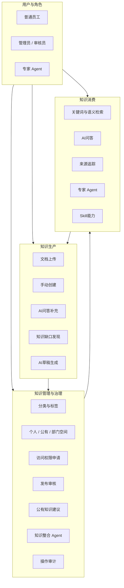
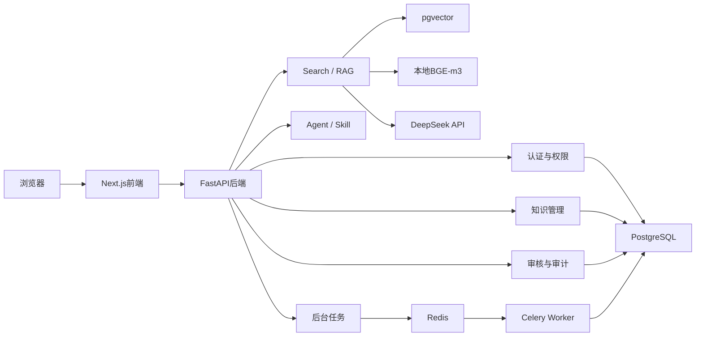

# AI 企业知识库管理平台架构说明

## 1. 项目定位

本项目面向企业内部知识流转场景，围绕三条业务主线建设：

1. 知识生产：文档导入、手动创建、AI问答补充和自动学习草稿。
2. 知识管理：分类标签、权限隔离、访问申请、发布审核、知识整合和审计。
3. 知识消费：混合检索、AI问答、专家Agent和Skill。

系统不是单纯RAG问答页面，而是包含知识治理和人工审核机制的企业知识平台原型。

## 2. 业务架构



知识消费产生的低质量反馈可以重新进入知识生产，因此形成持续学习闭环。

## 3. 技术架构



### 3.1 各层职责

- Next.js：页面、角色化导航、知识检索、文档预览、问答浮窗和审核交互。
- FastAPI：认证、业务规则、权限过滤、RAG编排、审核流程和审计记录。
- PostgreSQL：用户、文档、Chunk、会话、申请、授权和审核数据。
- pgvector：存储BGE-m3生成的1024维Chunk向量并执行相似度检索。
- Redis + Celery：处理大文件后台解析，避免阻塞上传请求。
- DeepSeek：回答生成、审核建议、知识草稿和知识整合；不可用时提供规则fallback。
- BGE-m3：本地生成真实语义向量，不向外部模型发送原始知识文本。

## 4. 核心数据与知识空间

系统使用统一Document与Chunk结构，不为每个用户创建独立数据库。

- `owner_id`标识知识所有者。
- `knowledge_space`区分`personal`、`public`、`department`。
- `knowledge_category`和结构化Tag用于分类筛选。
- `allowed_job_categories`约束公有或部门知识适用人员。
- `document_status`控制知识是否参与检索。

权限原则：

- 用户创建的知识默认进入个人空间。
- 普通用户不能查看或搜索他人的个人知识。
- 管理员也不能随意查看未提交审核的个人知识。
- 发布审核通过后创建公有知识引用，不复制或删除原文档。
- 公有引用下架不会删除用户原始知识。

## 5. 核心业务链路

### 5.1 文档生产链路

```text
上传文件
-> 创建文档与解析任务
-> 小文件同步解析 / 大文件进入Celery队列
-> 提取文本
-> Chunk切分
-> BGE-m3向量化
-> 写入PostgreSQL与pgvector
-> 进入个人知识空间
```

解析状态和检查点保存在PostgreSQL，失败后可以重试或继续解析，已生成的Chunk和向量尽量复用。

### 5.2 混合检索链路

```text
用户查询
-> 当前用户可见范围过滤
-> BGE-m3语义召回 + 关键词召回
-> 类别 / 标签 / 空间 / 文件类型筛选
-> 轻量重排
-> 返回文档与Chunk来源
```

权限过滤同时应用于知识库页面、Search Skill和RAG问答，避免只在前端隐藏数据。

### 5.3 AI问答链路

```text
用户问题 + 有限轮历史上下文
-> 权限内知识检索
-> 判断知识覆盖程度
-> 知识充分：基于来源回答
-> 知识不足：通用回答兜底
-> 保存问答、置信度、Trace ID和来源
-> 用户反馈
```

知识不足时，用户可以选择是否将回答整理为个人知识，不会直接写入公有知识库。

### 5.4 发布与访问审核

```text
个人知识提交发布申请
-> 填写类别、适用岗位、发布理由和业务用途
-> 管理员查看AI建议
-> 人工通过或拒绝
-> 通过后创建公有知识引用
```

文档访问申请采用相同的人机协同原则：AI输出建议、风险等级和理由，管理员完成最终决策。

### 5.5 自动学习闭环

```text
低置信度回答 / 用户无帮助反馈
-> 记录知识缺口
-> 聚合相似问题
-> AI生成知识草稿
-> 管理员编辑和审核
-> 发布为公有知识
-> 后续问答命中新知识
```

### 5.6 知识整合Agent

```text
BGE-m3 + pgvector发现相似文档
-> 综合语义与文本相似度排序
-> DeepSeek识别重复、补充和冲突
-> 生成带来源编号的整合草稿
-> 管理员审核
-> 创建整合知识文档
```

原始文档默认保留，管理员可以选择归档来源文档，但系统不会自动删除。

## 6. Agent与Skill

- Skill是可复用能力单元，例如知识检索、文档总结、流程提取、知识对比和缺口发现。
- Agent是知识范围、职责、回答边界、模型和多个Skill的组合。
- 专家Agent通过绑定特定知识范围形成垂直业务助手。
- 审核相关AI能力统一遵循“AI建议、人工决策”。

## 7. 部署架构

Docker Compose包含五个服务：

```text
frontend
backend
worker
redis
postgres + pgvector
```

`postgres_data`保存数据库，`uploads_data`保存上传文件；停止容器不会删除数据卷。本地开发数据库与Docker数据库相互独立。

## 8. 设计原则

- 默认最小权限，个人知识默认私有。
- AI负责辅助生成和分析，不自动审批公有知识。
- 检索前执行权限过滤，避免越权召回。
- 原始知识与公有引用分离，发布和下架不破坏原文档。
- 后台任务状态落库，Redis不作为最终状态来源。
- DeepSeek故障时核心流程有规则fallback。
- 通过Trace ID、来源引用和审计日志保证可追踪性。
